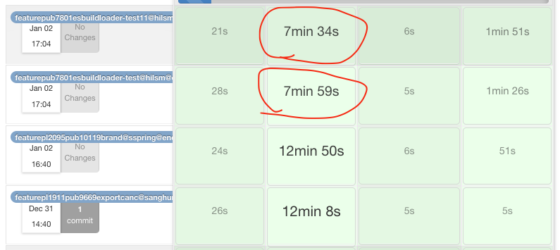
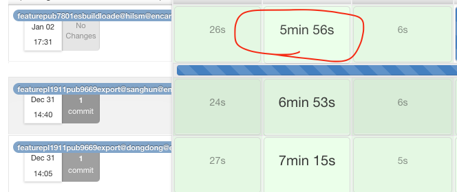
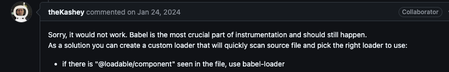

# esbuild-loader & Docker 멀티 스테이지

<span style="font-size: 30px;">결과</span>

### - Terser Minify -> esbuild Minify (60초~90초 단축)

### - Docker 멀티스테이지(클라이언트&서버 빌드를 병렬적으로 빌드)

### fem기준 5분가량 감소



### sell,car(nextjs) 1분가량 감소



<br/>
<br/>

## <span style="font-size: 25px;">esbuild-loader</span>

### 번들링 과정

### 1. Module Resolution

> 파일 간의 의존성을 탐색하고 필요한 모든 모듈을 가져오는 과정.

### 2. Transpiling

> 최신 문법을 호환 가능하도록 코드를 변환하는 과정

### 3. Optimization

> 변수명, 공백, 주석등 축약하여 최적화를 시키는 과정(minify)

<br/>

## NPM craco-esbuild 라이브러리

```
const CracoEsbuildPlugin = require('craco-esbuild');
module.exports = {
  plugins: [{ plugin: CracoEsbuildPlugin }],
};
```

> 해당 라이브러리 사용 시 babel-loader를 삭제시키고 esbuild-loader로 변환 시킨다

하지만 FEM에서는 위 과정 중 2번 Transpiling은 바벨을 그대로 사용 해야합니다.

### 바벨을 사용하지 못하는 이유

@loadable은 esbuild-loader사용이 안된다
<br/>
<br/>
컨튜리뷰터 왈
<br/>


<br/>

## 번들링의 과정 중 Optimization(minify)이라도 esbuild minify를 적용시키다

esbuild-loader 정보를 찾던 중 kakao FE블로그 보고 힌트를 얻어 적용 시켜보았습니다
<br/>
(https://fe-developers.kakaoent.com/2022/220707-webpack-esbuild-loader)

### craco-esbuild 내부코드에서 minify 로직만 빼서 적용하고자 생각했습니다
(https://github.com/pradel/create-react-app-esbuild/blob/main/packages/craco-esbuild/src/index.js)

```
/* eslint-disable */
const { EsbuildPlugin } = require("esbuild-loader");

const removeMinimizer = (webpackConfig, name) => {
    const idx = webpackConfig.optimization.minimizer.findIndex(
        (m) => m.constructor.name === name
    );
    webpackConfig.optimization.minimizer.splice(idx, 1);
};

const replaceMinimizer = (webpackConfig, name, minimizer) => {
    const idx = webpackConfig.optimization.minimizer.findIndex(
        (m) => m.constructor.name === name
    );
    idx > -1 && webpackConfig.optimization.minimizer.splice(idx, 1, minimizer);
};

module.exports = {
    overrideWebpackConfig: ({ webpackConfig, context: { paths } }) => {
        if (process.env.REACT_APP_DEPLOY_ENV !== "prod") {
            replaceMinimizer(
                webpackConfig,
                "TerserPlugin",
                new EsbuildPlugin({
                    target: "esnext",
                    css: true,
                })
            );
            removeMinimizer(webpackConfig, "OptimizeCssAssetsWebpackPlugin");
        }
        return webpackConfig;
    },
};

```

### esbuild-loader는 prod환경을 제외하여 젠킨스, 뱀부 모두 적용시켜 개발환경 테스트를 거치도록 하겠습니다

<br>
<br>
<br>

## <span style="font-size: 25px;">Docker multiStage</span>
### 기존 dockerfile의 문제점
1. work directory에 모노레포(frontencar-mobile) 모든 저장소 소스코드를 COPY하는 문제점
- 불필요한 services COPY로 인해 빌드시간 증가
2. 단일 stage로 인해 docker image 용량이 증가
- 도커 이미지를 만들고 내보내는 과정에서 도커이미지 용량이 클수록 내보내는 과정이 오래걸림
3. [FEM한정] 클라이언트 빌드와 서버 빌드 동기식으로 실행함
- 클라이언트 빌드가 끝나고 서버 빌드를 하기 때문에 빌드시간이 더 오래 걸림


### 해결방법
1. 빌드하고자 하는 서비스만 work directory에 COPY한다
2. deploy에 필요한 과정을 multi stage로 세분화 한다
3. fem은 패키지 빌드가 완료 후 동시에 빌드 실행되도록 stage를 나눈다
```
FROM 769475469275.dkr.ecr.ap-northeast-2.amazonaws.com/dockerhub/node:14.20.0 as install
WORKDIR /usr/src/app

<!-- 필요한 서비스만 copy -->
COPY ./.yarn ./.yarn
COPY ./packages ./packages
COPY ./services/fem ./services/fem
COPY ./.yarnrc.yml ./.yarnrc.yml
COPY ./package.json ./package.json
COPY ./turbo.json ./turbo.json
COPY ./yarn.lock ./yarn.lock

RUN yarn install
RUN env=qa yarn packages@build

<!-- 클라이언트 빌드 stage -->
FROM 769475469275.dkr.ecr.ap-northeast-2.amazonaws.com/dockerhub/node:14.20.0 as clientbuild
WORKDIR /usr/src/app  
COPY --from=install /usr/src/app .
WORKDIR /usr/src/app/services/fem
RUN env=qa yarn build

<!-- 서버 빌드 stage -->
FROM 769475469275.dkr.ecr.ap-northeast-2.amazonaws.com/dockerhub/node:14.20.0 as serverbuild
WORKDIR /usr/src/app  
COPY --from=install /usr/src/app .
WORKDIR /usr/src/app/services/fem
RUN env=qa yarn build:server

FROM 769475469275.dkr.ecr.ap-northeast-2.amazonaws.com/dockerhub/node:14.20.0 as start
WORKDIR /usr/src/app
COPY --from=install /usr/src/app .

WORKDIR /usr/src/app/services/fem
<!-- 클라이언트 output / 서버 output 가져온다 -->
COPY --from=clientbuild /usr/src/app/services/fem/build ./build
COPY --from=serverbuild /usr/src/app/services/fem/buildServer ./buildServer

CMD [ "node", "buildServer/server.js" ]
```


