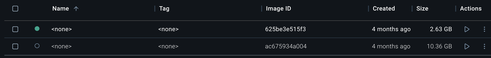

# esbuild-minify & 모노레포 Dockerfile 최적화

---

## 1. 결과 요약

| 개선 항목 | 내용 |
|-----------|------|
| **Minify** | Terser → **esbuild Minify** 전환 → **약 60~90초 단축** |
| **Docker** | **멀티스테이지** 도입 → 클라이언트·서버 빌드 **병렬 실행** |

### 서비스별 체감 효과

| 서비스 | 단축 규모 |
|--------|-----------|
| **FEM** | 약 **5분** 감소 |


| 서비스 | 단축 규모 |
|--------|-----------|
| **sell, car (Next.js)** | 약 **1분** 감소 |


---

## 2. esbuild-loader와 번들링 과정

### 번들링 3단계

| 단계 | 이름 | 설명 |
|------|------|------|
| 1 | **Module Resolution** | 파일 간 의존성 탐색, 필요한 모듈을 모두 수집 |
| 2 | **Transpiling** | 최신 문법을 대상 환경에 맞게 변환 |
| 3 | **Optimization (Minify)** | 변수명·공백·주석 축약 등으로 최적화 |

---

## 3. craco-esbuild와 FEM의 제약

### craco-esbuild 기본 동작

- 사용 시 **babel-loader 제거** 후 **esbuild-loader**로 전환
- 설정 예:

```javascript
const CracoEsbuildPlugin = require('craco-esbuild');
module.exports = {
  plugins: [{ plugin: CracoEsbuildPlugin }],
};
```

### FEM에서는 Transpiling은 Babel 유지

- 위 3단계 중 **2번 Transpiling**은 FEM에서 **Babel을 그대로 사용**해야 함
- **이유**: **@loadable**이 esbuild-loader와 호환되지 않음 (컨트리뷰터 설명 참고)


---

## 4. Minify만 esbuild로 적용

- 전체를 esbuild-loader로 바꾸지 않고, **Optimization(Minify) 단계만** esbuild로 교체
- 참고: [카카오 FE – webpack esbuild-loader](https://fe-developers.kakaoent.com/2022/220707-webpack-esbuild-loader)
- 구현 아이디어: **craco-esbuild 내부 코드에서 minify 로직만 가져와 적용**  
  - [craco-esbuild 소스](https://github.com/pradel/create-react-app-esbuild/blob/main/packages/craco-esbuild/src/index.js)

### 적용 코드 요약

- **TerserPlugin** → **EsbuildPlugin**으로 교체
- **OptimizeCssAssetsWebpackPlugin** 제거 (esbuild가 CSS 포함 처리)
- **prod 환경은 제외**, Jenkins·Bamboo 등에서 먼저 적용 후 검증 예정

```javascript
/* eslint-disable */
const { EsbuildPlugin } = require("esbuild-loader");

const removeMinimizer = (webpackConfig, name) => {
  const idx = webpackConfig.optimization.minimizer.findIndex(
    (m) => m.constructor.name === name
  );
  webpackConfig.optimization.minimizer.splice(idx, 1);
};

const replaceMinimizer = (webpackConfig, name, minimizer) => {
  const idx = webpackConfig.optimization.minimizer.findIndex(
    (m) => m.constructor.name === name
  );
  idx > -1 && webpackConfig.optimization.minimizer.splice(idx, 1, minimizer);
};

module.exports = {
  overrideWebpackConfig: ({ webpackConfig, context: { paths } }) => {
    if (process.env.REACT_APP_DEPLOY_ENV !== "prod") {
      replaceMinimizer(
        webpackConfig,
        "TerserPlugin",
        new EsbuildPlugin({ target: "esnext", css: true })
      );
      removeMinimizer(webpackConfig, "OptimizeCssAssetsWebpackPlugin");
    }
    return webpackConfig;
  },
};
```

---

## 5. Docker 멀티스테이지 최적화

### 기존 Dockerfile의 문제

| # | 문제 | 영향 |
|---|------|------|
| 1 | work directory에 **모노레포 전체** 소스 COPY | 불필요한 services까지 포함 → **빌드 시간 증가** |
| 2 | **단일 스테이지** 위주 구성 | 이미지 용량 증가 → **이미지 빌드·푸시 시간 증가** |
| 3 | [FEM 한정] 클라이언트 빌드와 서버 빌드 **순차 실행** | 클라이언트 끝난 뒤 서버 빌드 → **빌드 시간 증가** |

### 적용한 해결 방향

| # | 해결 |
|---|------|
| 1 | **빌드할 서비스만** work directory에 COPY |
| 2 | 배포 단계를 **멀티스테이지**로 나누어 단계별 최적화 |
| 3 | FEM: 패키지 빌드 완료 후 **클라이언트·서버 빌드를 동시에** 실행하도록 스테이지 분리 |

### Dockerfile 예시 (FEM)

```dockerfile
# 필요한 서비스만 copy
FROM .../node:14.20.0 as install
WORKDIR /usr/src/app
COPY ./.yarn ./.yarn
COPY ./packages ./packages
COPY ./services/fem ./services/fem

FROM .../node:20.9.0 as base
ENV SERVICE_DOMAIN=fem
WORKDIR /usr/src/app
COPY ./.yarn ./.yarn
COPY ./packages ./packages
COPY ./.yarnrc.yml ./.yarnrc.yml
COPY ./package.json ./package.json
COPY ./turbo.json ./turbo.json
COPY ./yarn.lock ./yarn.lock
COPY ./services/fem ./services/${SERVICE_DOMAIN}
RUN yarn install
RUN env=qa yarn packages@build

FROM base as build
WORKDIR /usr/src/app/services/${SERVICE_DOMAIN}
# 클라이언트 & 서버 병렬 빌드
RUN env=qa yarn build:server & env=qa yarn build

FROM base as start
WORKDIR /usr/src/app/services/${SERVICE_DOMAIN}
COPY --from=build /usr/src/app/services/${SERVICE_DOMAIN}/build ./build
COPY --from=build /usr/src/app/services/${SERVICE_DOMAIN}/buildServer ./buildServer
CMD [ "yarn", "fem@start:server" ]
```



---

## 발표 시 참고 요약

| 구분 | 내용 |
|------|------|
| **결과** | Terser→esbuild Minify(60~90초↓), Docker 멀티스테이지로 FEM 약 5분↓, sell/car 약 1분↓ |
| **번들링** | 1) Resolution 2) Transpiling 3) Minify — FEM은 @loadable 때문에 Transpiling은 Babel 유지 |
| **Minify** | craco-esbuild에서 minify만 가져와 Terser→EsbuildPlugin 교체, prod 제외 후 단계적 적용 |
| **Docker** | 필요한 서비스만 COPY, 멀티스테이지로 용량·빌드 시간 절감, FEM은 클라이언트·서버 병렬 빌드 |

---

## 2025.05.12 현황

*(발표 시점 최신 현황으로 보완)*
