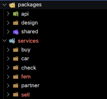
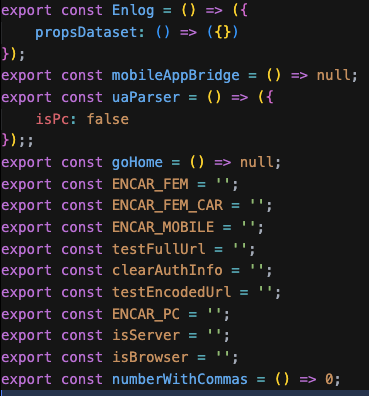

# 죽어 있던 엔카 스토리북 살려보기

---

## 1. 왜 스토리북이 죽었나

| 순서 | 내용 |
|------|------|
| 1 | 프론트엔드 팀이 **모노레포** 도입 시 UI 디자인 컴포넌트를 **Vite**로 전환 |
| 2 | Storybook은 Webpack 기반 → Vite 환경에 맞게 번들러 수정 필요 |
| 3 | 모노레포를 도입한 개발자 **이직**으로 Vite/Storybook 정보가 없어 수정이 어려움 |

---

## 2. 수정 시도

### 2-1. Vite 공식 문서대로 설정 → 실패

- **문서**: [Storybook – React Vite](https://storybook.js.org/docs/get-started/frameworks/react-vite)
- 공식 프레임워크 설정 방법으로는 **성공하지 못함**

**실패 원인**

- 현재 모노레포 환경: **Vite 버전 + Node v14** 제약
- 위 프레임워크 옵션은 **Storybook 7.x 이상**에서만 지원
- 참고: [Storybook 7 마이그레이션 가이드](https://storybook.js.org/docs/7/migration-guide)

---

### 2-2. `@storybook/builder-vite` 사용 → 빌더만 Vite로 전환

- **NPM**: [@storybook/builder-vite](https://www.npmjs.com/package/@storybook/builder-vite)
- Storybook은 유지하고, **번들링만 Vite**로 처리하도록 적용

**적용 결과**

- 공식 문서 + NPM 사용법 참고해 설정 후, 필요한 addon만 추가 설치
- 아래와 같은 `main.js` 형태로 정리

```javascript
module.exports = {
    typescript: { check: false, reactDocgen: 'react-docgen' },
    stories: ['../src/**/*.stories.mdx', '../src/**/*.stories.@(js|jsx|ts|tsx)'],
    addons: [
        { name: '@storybook/preset-scss', options: { cssLoaderOptions: { modules: true, localIdentName: '[name]__[hash:base64:5]' } } },
        '@storybook/addon-links',
        '@storybook/addon-essentials',
        '@storybook/addon-interactions',
    ],
    framework: '@storybook/react',
    core: { builder: '@storybook/builder-vite' },
};
```

---

## 3. 로컬은 되는데, 정적 빌드가 실패

- `npm run storybook` → 빌드 성공, 브라우저에서 스토리 정상 표시
- **배포용 정적 사이트 빌드** 시 오류 발생

### 원인

| 항목 | 설명 |
|------|------|
| design 패키지 | `vite.config`에서 **lib 모드** 사용 중 |
| lib 모드 | `index.js` 기준 Module Resolution → 번들 결과를 index 형태로 내보냄 (다른 패키지에서 import 용) |
| Storybook build | 결과물이 **정적 사이트**여야 함 → lib 모드와 목적이 다름 |

### 해결: lib 모드 비활성화

- design의 **lib 모드**를 쓰지 않고 빌드하면 됨
- `vite.config`를 불러온 뒤, **`build`만 빈 객체로 덮어쓰기**

```javascript
async viteFinal(config) {
    const { config: userConfig } = await loadConfigFromFile(path.resolve(__dirname, '../vite.config.js'));
    userConfig.build = {};  // lib 모드 비활성화
    return mergeConfig(config, {
        ...userConfig,
        resolve: {
            alias: { app: path.resolve(root, './src') },
        },
    });
}
```

---

## 4. 모노레포 패키지 종속성 문제

- 스토리 작성 중 **`header.tsx`**에서 종속성(해석 경로) 문제 발생
- 먼저 **엔카 모노레포 구조**를 이해할 필요가 있음



### 문제 정리

| 구분 | 내용 |
|------|------|
| `header.tsx` | `packages/api`의 로그인 관련 API를 사용 |
| 각 패키지 | `app` → `./src` 로 resolve 설정 |
| 실제 동작 | Storybook은 **design** 패키지 기준으로 실행 → `app`이 design의 `./src`로 해석됨 |
| 결과 | `packages/api` 쪽 코드를 찾을 때 design 기준으로 찾게 되어 **파일 없음 에러** 발생 |

---

### 해결: Mock으로 API·Shared 대체

- 처음엔 **transform 플러그인**으로 `app/` 경로를 상대 경로로 바꾸는 방안 검토
  - 경로를 일일이 지정해야 해서 복잡도가 커짐
- 결론: Storybook에서는 **UI만 보여주면 되므로** `packages/api`, `packages/shared`의 실제 구현이 필요하지 않음
- **TDD의 Mock**처럼, `.storybook/mock` 아래에 api·shared를 흉내 낸 파일을 두고, 해당 경로로 **resolve**되도록 설정

**resolve alias 추가**

```javascript
resolve: {
    alias: {
        app: path.resolve(root, './src'),
        '@encarpkg/api': path.resolve(root, './.storybook/mock/@encarpkg/api'),
        '@encarpkg/shared': path.resolve(root, './.storybook/mock/@encarpkg/shared'),
    },
},
```

**mock 폴더 구조 예시**



---

## 5. 최종 결과: 로컬 실행 & 프로덕션 배포 성공

- **로컬 실행**과 **정적 사이트 빌드(프로덕션 배포)** 모두 성공
- 아래는 최종 `.storybook/main.js` 요약 (핵심만)

```javascript
const path = require('path');
const { loadConfigFromFile, mergeConfig } = require('vite');
const root = process.cwd();

module.exports = {
    typescript: { check: false, reactDocgen: 'react-docgen' },
    stories: ['../src/**/*.stories.mdx', '../src/**/*.stories.@(js|jsx|ts|tsx)'],
    addons: [
        { name: '@storybook/preset-scss', options: { cssLoaderOptions: { modules: true, localIdentName: '[name]__[hash:base64:5]' } } },
        '@storybook/addon-links',
        '@storybook/addon-essentials',
        '@storybook/addon-interactions',
    ],
    framework: '@storybook/react',
    core: { builder: '@storybook/builder-vite' },
    async viteFinal(config) {
        const { config: userConfig } = await loadConfigFromFile(path.resolve(__dirname, '../vite.config.js'));
        userConfig.build = { chunkSizeWarningLimit: 5000 };

        return mergeConfig(config, {
            ...userConfig,
            resolve: {
                alias: {
                    app: path.resolve(root, './src'),
                    '@encarpkg/api': path.resolve(root, './.storybook/mock/@encarpkg/api'),
                    '@encarpkg/shared': path.resolve(root, './.storybook/mock/@encarpkg/shared'),
                },
            },
        });
    },
};
```

---

## 발표 시 참고 요약

| 단계 | 내용 |
|------|------|
| 1. 배경 | 모노레포 + Vite 전환 후, Storybook(Webpack) 수정 인력 부재 |
| 2. 시도 1 | 공식 React-Vite 가이드 → SB 7+ 필요, 현재 환경 미지원으로 실패 |
| 3. 시도 2 | `@storybook/builder-vite`로 번들만 Vite 전환 → 로컬 성공 |
| 4. 이슈 1 | 정적 빌드 실패 → design의 lib 모드와 충돌 → `viteFinal`에서 `build` 오버라이드 |
| 5. 이슈 2 | design에서 api/shared 사용 시 resolve 충돌 → mock 폴더 + alias로 해결 |
| 6. 결과 | 로컬 + 프로덕션 빌드 모두 성공 |
